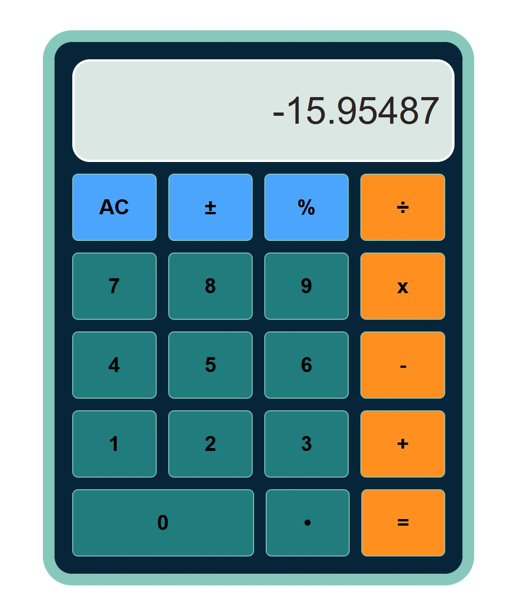

# Simple Calculator 📟
https://bunyaminozturk-calculator.netlify.app/

This is a simple calculator made with JavaScript.

This project is final project of the JavaScript Foundations section from [The Odin Project](https://www.theodinproject.com/).

## What I Used

- HTML
- CSS(`Flexbox`)
- JavaScript
- Functions
- Conditionals (`if/else`)
- Loops (`forEach`) for check all number buttons

---

## Notes

This is a practice project to help me understand how JavaScript works. There are many bugs at calculating screen.
Later on, I might turn this project to fix bug of not being able to write fractional numbers after the division and multiplication symbol.